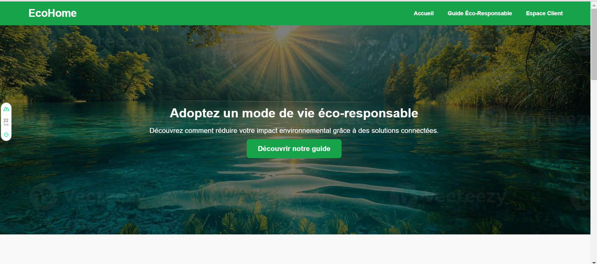

# Logement Éco-Responsable - Projet IoT

Ce projet vise à développer une solution complète pour gérer un logement connecté et éco-responsable. Il intègre :
- Un backend RESTful avec FastAPI pour gérer les dispositifs, logements et consommations.
- Un frontend interactif avec Nuxt.js pour permettre aux utilisateurs de visualiser et contrôler leurs données.
- Une base de données SQLite pour stocker toutes les informations nécessaires.

Ce projet a été réalisé dans le cadre du **TP IoT**.

---

## 🌟 Fonctionnalités

- **Gestion des dispositifs connectés** : Ajout, suppression et visualisation des capteurs et actionneurs.
- **Visualisation des consommations énergétiques** : Électricité, gaz, eau, etc.
- **Suivi des économies réalisées** : Analyse des économies financières et environnementales grâce aux dispositifs connectés.
- **Configuration des logements** : Gestion des informations de chaque logement.

---

## 📷 Aperçu du Site



Voici une capture d'écran du site fonctionnel, montrant la page d'accueil principale. L'interface est intuitive, moderne et adaptée aux écrans mobiles.

---

## 📁 Structure du Projet

- **Backend_et_BDD_Amina/** :
  - `backend.py` : Code du serveur backend.
  - `logement.sql` : Script SQL pour créer la base de données.
  - `remplissage.py` : Script pour insérer des données fictives dans la base de données.
- **Frontend_Amina/** :
  - `mon-site-iot/` :
    - `pages/` : Contient les pages principales du site web.
    - `components/` : Contient les composants réutilisables.
    - `public/` : Contient les images et ressources statiques.
- **README.md** : Ce fichier contient une description générale du projet.

---

## ⚙️ Pré-requis

Avant de démarrer le projet, assurez-vous d'avoir les outils suivants installés sur votre machine :

- **Python 3.11** (pour le backend)
- **Node.js 16 ou supérieur** (pour le frontend)
- **SQLite3** (pour gérer la base de données)

---
## 🛠️ Testez l'Espace Client avec un compte de test

Pour effectuer un premier test sur l'Espace Client, vous pouvez utiliser les identifiants suivants :

- **Email** : `aminazarroug@gmail.com`
- **Mot de passe** : `hello123`

---


## 🚀 Installation 

### Clonez le repository
```bash
git clone https://github.com/Aminazarroug/Logement_EcoResponsable_Amina_ZARROUG.git
cd Logement_EcoResponsable_Amina_ZARROUG